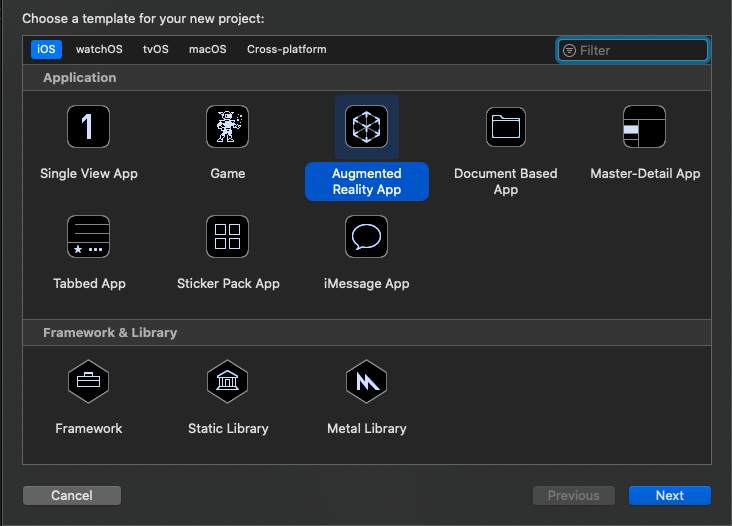
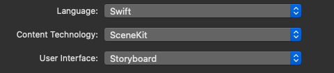
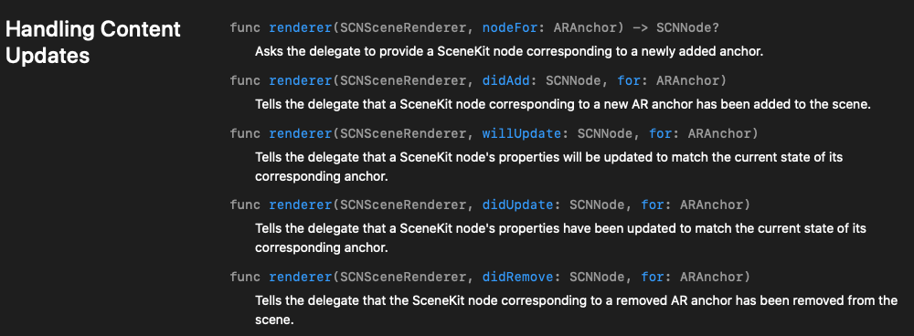
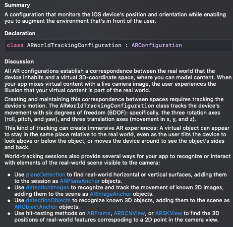
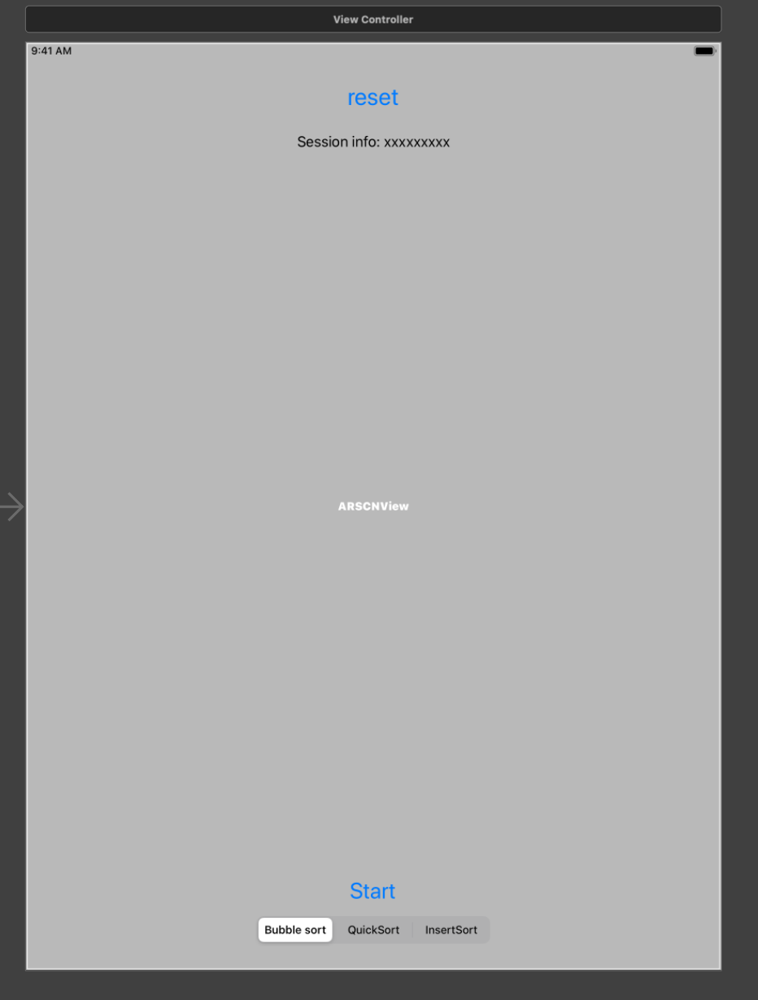

# ARKit + SceneKit 上手： 开发一个排序算法可视化工具
#ios/arkit学习

## 介绍
为了更好的学习ARKit的相关用法，我们制作了一个基于ARKit和SceneKit的排序算法的可视化工具，项目的效果展示为：

.gif)


## 准备
首先在Xcode中创建项目，选择Argumened Reality App并选择使用的技术架构为SceneKit。





项目创建完毕后，直接运行项目，会看到如下的效果：

这是框架代码为我们创建的例子，在viewDidLoad函数中
``` swift
override func viewDidLoad() {
        super.viewDidLoad()
        
        // Set the view's delegate
        sceneView.delegate = self
        
        // Show statistics such as fps and timing information
        sceneView.showsStatistics = true
        
        // Create a new scene
        let scene = SCNScene(named: "art.scnassets/ship.scn")!
        
        // Set the scene to the view
        sceneView.scene = scene
    }
```

框架代码使用场景文件创建了一个场景，并显示在seneView中。

接着我们来看框架代码中的ViewController是实现了代理ARSCNViewDelegate的，这也是比较关键的和场景进行直接互动的代理，首先来看这个代理中需要实现的函数：



这个代理和内容渲染相关的有五个重载的renderer函数，它们的作用分别是
+ 识别到新的锚点时应该添加什么样的scene node，如果不实现这个函数的话，就默认创建一个空的node，在这里我们不需要实现这个函数
+ 在添加node后应该做什么，在这里我们需要将我们想要出现在场景中的节点添加为SCNNode的子节点。
+ 更新锚点和对应的Node之前进行调用，因为随着设备的移动或者光照等条件的变化，锚点也会变动。ARKit会自动的在更新锚点后更新Node以及子Node，所以在这里一般进行一个统计的工作，统计锚点变动的次数，当锚点更新次数到达一定阈值，就可以认为已经捕捉到了足够的特征点。
+ 更新锚点和Node之后调用
+ 移除锚点和Node之后调用

## 实现ARSCNViewDelegate代理
我们主要针对第二个和第三个函数给出实现：
+ 在添加了SCNNode后需要做的：
``` swift
// node添加到新的锚点上之后(一般在这个方法中添加几何体节点,作为node的子节点)
    func renderer(_ renderer: SCNSceneRenderer, didAdd node: SCNNode, for anchor: ARAnchor) {
        //1.获取捕捉到的平地锚点,只识别并添加一个平面
        if let planeAnchor = anchor as? ARPlaneAnchor,node.childNodes.count < 1,updateCount < 1 {
            print("捕捉到平地")
            //2.创建一个平面    （系统捕捉到的平地是一个不规则大小的长方形，这里笔者将其变成一个长方形）
            let plane = SCNPlane(width: CGFloat(planeAnchor.extent.x), height: CGFloat(planeAnchor.extent.z))
            //3.使用Material渲染3D模型（默认模型是白色的，这里笔者改成红色）
            plane.firstMaterial?.diffuse.contents = UIColor.black
            //4.创建一个基于3D物体模型的节点
            planeNode = SCNNode(geometry: plane)
            //5.设置节点的位置为捕捉到的平地的锚点的中心位置  SceneKit框架中节点的位置position是一个基于3D坐标系的矢量坐标SCNVector3Make
            planeNode?.simdPosition = SIMD3(planeAnchor.center.x, 0, planeAnchor.center.z)
            //6.`SCNPlane`默认是竖着的,所以旋转一下以匹配水平的`ARPlaneAnchor`
            planeNode?.eulerAngles.x = -.pi / 2
            
            //7.更改透明度
            planeNode?.opacity = 0.0
            //8.添加到父节点中
            node.addChildNode(planeNode!)
            
            
            //9. 放置一系列的长方体
            for i in 0..<20 {
                boxNodes[i].position = SCNVector3Make(planeAnchor.center.x + (Float(i) / 20.0 - 0.5) / 2.0, (0.025 + 0.1 * values[i])/2.0, planeAnchor.center.z)
                node.addChildNode(boxNodes[i])
            }
        }
    }
```

我们的根据锚点，创建一个透明平面和一组打乱顺序大小不一的长方体来代表需要被排序的对象。

+ 在Update锚点后需要做的：
``` swift
// 更新锚点和对应的node之前调用,ARKit会自动更新anchor和node,使其相匹配
    func renderer(_ renderer: SCNSceneRenderer, willUpdate node: SCNNode, for anchor: ARAnchor) {
        // 只更新在`renderer(_:didAdd:for:)`中得到的配对的锚点和节点.
        guard let planeAnchor = anchor as?  ARPlaneAnchor,
            let planeNode = node.childNodes.first,
            let plane = planeNode.geometry as? SCNPlane
            else { return }
        
        updateCount += 1
        if updateCount > 10 {//平面超过更新10次,捕捉到的特征点已经足够多了,可以显示进入游戏按钮
            DispatchQueue.main.async {
                self.startButton.isHidden = false
                self.infoLabel.isHidden = true
            }
        }
        
        // 平面的中心点可以会变动.
        planeNode.simdPosition = SIMD3(planeAnchor.center.x, 0, planeAnchor.center.z)
        
        /*
         平面尺寸可能会变大,或者把几个小平面合并为一个大平面.合并时,`ARSCNView`自动删除同一个平面上的相应节点,然后调用该方法来更新保留的另一个平面的尺寸.(经过测试,合并时,保留第一个检测到的平面和对应节点)
         */
        plane.width = CGFloat(planeAnchor.extent.x)
        plane.height = CGFloat(planeAnchor.extent.z)
    }
```


## 修改viewWillAppear和viewWillAppear
``` swift
override func viewWillAppear(_ animated: Bool) {
        super.viewWillAppear(animated)
        
        resetAll()
    }
    
    override func viewWillDisappear(_ animated: Bool) {
        super.viewWillDisappear(animated)
        
        // Pause the view's session
        sceneView.session.pause()
    }
```

在resetAll中，初始化和sceneView的session有关的变量，并开启平面检测的session
这部分的实现封装为：
``` swift
private func resetTracking() {
        // Create a session configuration
        let configuration = ARWorldTrackingConfiguration()
        
        // Find a horizontal plane
        configuration.planeDetection = .horizontal
        configuration.isLightEstimationEnabled = true
        
        // Run the view's session
        sceneView.session.run(configuration,options: [.resetTracking, .removeExistingAnchors])
    }
```

在启动session需要提供一个ARWorldTrackingConfiguration，这个类型的描述为：

可以看出，不仅可以进行平面检测，也可以是图像检测，物体检测。这里我们配置其为检测一个水平的平面来放置我们的长方体。

## 添加必要的UI组件
为应用加上Start和Reset两个按钮以及选择排序算法的picker


## 排序算法实时展示
当场景加载完毕并识别到平面后，会放置好长方体并显示出start按钮，start按钮触发后会根据选择的排序算法进行排序操作。排序的过程中主要涉及一个swap操作是需要通过动画展示出来的。当排序算法需要交换第i和第j个元素时，应该告诉ViewController，显示第i个box和第j个box交换的动画：
``` swift
private func swapBox(box1 i: Int, box2 j: Int) {
        let box1 = boxNodes[i]
        let box2 = boxNodes[j]
        let action1 = SCNAction.move(by: SCNVector3Make(0, -0.125, 0), duration: 0.1)
        let action2 = SCNAction.move(by: SCNVector3Make(0, 0.125, 0), duration: 0.1)
        let action3 = SCNAction.move(by: SCNVector3Make(box2.position.x - box1.position.x, 0, 0), duration: 0.1)
        let action4 = SCNAction.move(by: SCNVector3Make(box1.position.x - box2.position.x, 0, 0), duration: 0.1)
        let action5 = SCNAction.move(by: SCNVector3Make(0, 0.125, 0), duration: 0.1)
        let action6 = SCNAction.move(by: SCNVector3Make(0, -0.125, 0), duration: 0.1)
        
        let sequences1 = SCNAction.sequence([action1, action3, action5])
        let sequences2 = SCNAction.sequence([action2, action4, action6])
        
        // 获取信号量
        self.getSemphore()
        self.getSemphore()
        
        // 动画结束后再释放信号量
        box1.runAction(sequences1, completionHandler: self.releaseSemphore)
        box2.runAction(sequences2, completionHandler: self.releaseSemphore)
        
        boxNodes[i] = box2
        boxNodes[j] = box1
        
        print("swap return")
    }
```

我们将动画的播放组织称SCNAction的Sequence并交由box来执行，注意runAction函数并不是等到动画播放完才返回，而是立刻返回，因此需要通过信号量来进行一个控制，这个之后再介绍。当swapBox函数被调用时，就会触发两个box被交换的动画。

我将排序算法组织成一个Sort类，并设计了两个代理：
``` swift
public protocol SortDelegate {
    func swap(i: Int, j: Int)
}

public protocol SemphoreDelegate {
    func getSemphore()
    func releaseSemphore()
}

public class Sorter {
    var values: [Float]
    var sortDelegate: SortDelegate
    var semphoreDelegate: SemphoreDelegate
	...
}
```

当排序算法要进行交换时，必须先获取信号量，以确保动画已经放映完毕了，然后再释放信号量，进行交换。在swapBox触发时，也会获取信号量，在动画放映完毕后，才会通过回调来释放信号量。
以插入排序算法为例：
``` swift
func insertSort() {
        let n = values.count
        for i in 1..<n {
            for j in (1...i).reversed() {
                if values[j] < values[j-1] {
                    self.semphoreDelegate.getSemphore()
                    self.semphoreDelegate.getSemphore()
                    print("animation completed")
                    print("Sorter get semphore, ready to swap two box")
                    self.semphoreDelegate.releaseSemphore()
                    self.semphoreDelegate.releaseSemphore()
                    print("Sorter release semphore and call swap")
                    self.sortDelegate.swap(i: j-1, j: j)
                    print("swap finished")
                    let temp = values[j]
                    values[j] = values[j-1]
                    values[j-1] = temp
                }
            }
        }
    }
```
通过信号量控制了动画和算法运行的同步。

## Start按钮触发算法运行
当点下Start按钮时，我们不能直接运行sort算法，这样sort算法也是运行在DispatchQueue.main中的，和动画播放的算法在一个线程中，会导致场景渲染的停滞。因此需要把排序算法的执行放在其他的线程中：
``` swift
    @IBAction func startButtonPress(_ sender: Any) {
        print("Select \(algorithms[algorithmChooseView.selectedSegmentIndex])")
        startButton.isHidden = true
        resetButton.isHidden = true
        self.stopTracking()
        var alg: Sorter.algorithm
        switch algorithmChooseView.selectedSegmentIndex {
        case 0:
            alg = .bubbleSort
        case 1:
            alg = .quickSort
        case 2:
            alg = .insertSort
        default:
            alg = .bubbleSort
        }
        let operationQueue = OperationQueue()
        let group = DispatchGroup()
        group.enter()
        operationQueue.addOperation {
            self.sorter.sort(using: alg)
            group.leave()
        }
        
        group.notify(queue: .main, execute: {
            self.resetButton.isHidden = false
        })
        
    }
```

